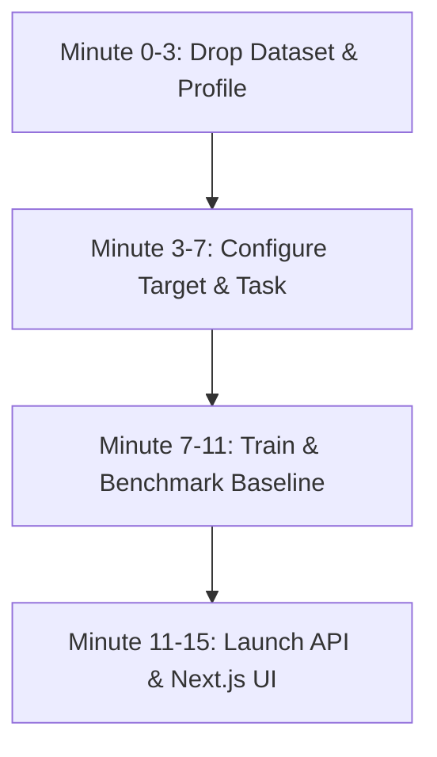

# ⚡ RESUMEFORGE AI — 15-MINUTE HACKATHON ADAPTATION PLAYBOOK

When your hackathon team receives a new, unknown dataset or resume intelligence challenge, follow this **15-Minute Rapid Adaptation Playbook** to transform **ResumeForge AI** into a customized production prototype.

---

## ⏱️ THE 15-MINUTE ROADMAP



---

## 🚀 STEP-BY-STEP ADAPTATION GUIDE

### Step 1: Ingest Unknown Dataset (Minutes 0–3)
1. Place your dataset inside `data/raw/` (e.g. `data/raw/my_hackathon_dataset.csv` or `.xlsx`).
2. Run the automated dataset profiler CLI:
   ```bash
   python scripts/analyze_dataset.py data/raw/my_hackathon_dataset.csv
   ```
3. Inspect the profile summary:
   - Identifies text columns vs target columns
   - Suggests task type (`classification`, `matching`, `ranking`, `regression`, `skill_extraction`) with confidence score.

---

### Step 2: Configure `config.yaml` (Minutes 3–7)
Update the top-level keys in `config.yaml` to point to your new dataset and target column:

```yaml
dataset:
  path: "data/raw/my_hackathon_dataset.csv"
  target: "your_target_column_name"

text:
  columns:
    - "resume_text"

task:
  type: "classification" # Options: classification, matching, ranking, regression, skill_extraction
```

*Tip: If you don't edit `config.yaml`, the system automatically detects the best text and target columns at runtime!*

---

### Step 3: Auto-Train & Benchmark Models (Minutes 7–11)
Run the automated model training & benchmarking script:
```bash
python scripts/train_model.py
```
What happens automatically:
- Text normalization & cleaning (URL/email/HTML removal)
- TF-IDF unigram & bigram feature extraction
- Lightweight baseline model training (Logistic Regression, Linear SVM, Random Forest, Naive Bayes)
- Model selection based on F1-Score & Accuracy
- Artifact persistence in `models/best_model.joblib` and `models/metadata.json`.

---

### Step 4: Launch Backend & Frontend (Minutes 11–15)

1. **Start FastAPI Backend (Terminal 1):**
   ```bash
   uvicorn backend.main:app --reload --port 8000
   ```
2. **Start Next.js Dashboard (Terminal 2):**
   ```bash
   cd frontend
   npm run dev
   ```
3. **Open Dashboard:** Navigate to `http://localhost:3000`.

---

## 🏆 DEMO MODE FOR JUDGES (1-CLICK PRESENTATION)
If you want an instant zero-configuration demo during presentations:
1. Open the UI at `http://localhost:3000`.
2. Click **"Load Demo Data"** at the top.
3. The system will load the synthetic dataset, train baseline models, extract skills, and generate candidate rankings in under 5 seconds!

---

## 🛠️ EXTENDING TASK PLUGINS
To add a new custom NLP task during a hackathon:
1. Create `tasks/my_custom_task.py` inheriting from `BaseTask`.
2. Implement `validate()` and `execute()`.
3. Add to `TASK_REGISTRY` in `tasks/__init__.py`.

```python
from tasks.base import BaseTask

class MyTask(BaseTask):
    name = "custom_task"
    description = "Custom NLP Task"
    
    def validate(self, df, config):
        return True
        
    def execute(self, data, config):
        return {"result": "custom output"}
```

---

## 🔌 API CHEATSHEET
- `GET /health` — Health check
- `POST /demo/load` — Load synthetic demo dataset & train baseline
- `POST /dataset/upload` — Upload new dataset
- `POST /dataset/profile` — Infer schema & suggest target/task
- `POST /train` — Benchmark baseline models & save best model
- `POST /predict` — Real-time inference + feature explainability
- `POST /analyze-resume` — Parse resume, extract skills, calculate quality score
- `POST /match` — Profile-to-Job similarity match
- `POST /rank` — Multi-candidate ranking matrix
