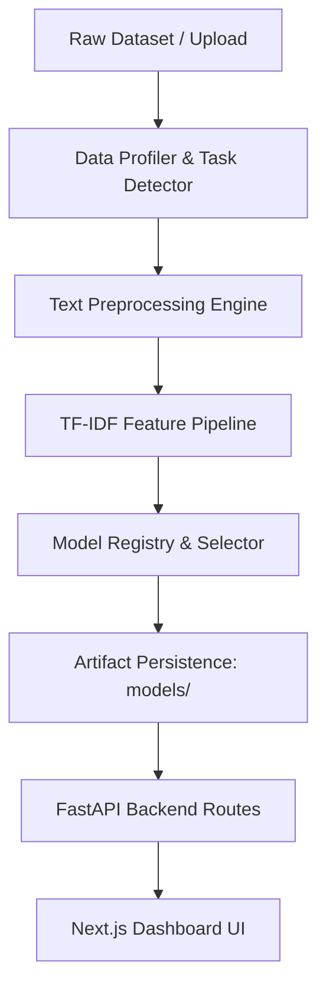

# ⚡ RESUMEFORGE AI — RESUME INTELLIGENCE HACKATHON STARTER KIT

> A production-grade, modular, dataset-independent NLP & Machine Learning starter kit designed to rapidly adapt to any unknown resume intelligence problem during a hackathon in **15–30 minutes**.

---

## 🌟 KEY FEATURES

- 🔄 **Dataset Independent & Schema Agnostic**: Accepts any unknown tabular dataset (`.csv`, `.xlsx`). Automatically detects text columns, categorical variables, target columns, and suggests optimal ML task types.
- ⚡ **Lightweight & Offline-First**: Operates 100% locally with TF-IDF, Scikit-Learn, and optional Sentence-Transformers embedding fallbacks. Zero external API keys required!
- 🧪 **Automated Model Selector & Leaderboard**: Trains and benchmarks multiple baseline models (Logistic Regression, Linear SVM, Random Forest, Naive Bayes) and automatically selects the highest-performing model based on F1-Score / Accuracy.
- 🔍 **Explainability & Attribution**: Extracts TF-IDF word importances and top feature signals to explain predictions transparently to hackathon judges.
- 🎯 **Skill Extraction Taxonomy**: Configurable `data/skills.json` taxonomy matcher for extracting programming, cloud, machine learning, and domain skills.
- 📊 **Resume Quality Score**: Heuristic completeness score evaluating contact detection, section structure, word count, and skill richness.
- 🤝 **Profile-to-Job Matching & Candidate Ranking**: Cosine similarity matching engine comparing candidates against job descriptions and outputting match matrices.
- 🔌 **Task Plugin Architecture**: Extensible plugin system supporting Classification, Job Matching, Candidate Ranking, Skill Extraction, Scoring, Recommendation, Regression, and Clustering.
- 🖥️ **FastAPI Backend & Next.js Frontend**: REST API with standard JSON response wrappers paired with a dark-mode glassmorphic dashboard.
- 🏆 **1-Click Demo Mode**: Built-in `/demo/load` endpoint for instant zero-configuration judge presentations.

---

## 🏗️ SYSTEM ARCHITECTURE



---

## 📂 REPOSITORY STRUCTURE

```
SAMATRIX-RESUMEFORGE-_vision-x/
├── backend/                  # FastAPI REST API Backend
│   ├── routes/               # API Endpoint Routes (health, dataset, train, predict, analyze, match, metrics, demo)
│   ├── services/             # Business Logic (analysis_service, prediction_service, file_service)
│   ├── schemas.py            # Pydantic Validation Models
│   └── main.py               # FastAPI App & Middleware
├── ml/                       # Core ML & NLP Pipeline
│   ├── config.py             # Dynamic Configuration Manager
│   ├── data_loader.py        # Encoding-Safe CSV/Excel Loader
│   ├── data_profiler.py      # Automated Schema Profiler & Task Detector
│   ├── preprocessing.py      # Text Normalization & Cleaning Pipeline
│   ├── feature_engineering.py# TF-IDF Vectorizer Pipeline
│   ├── embeddings.py         # Embedding Pipeline with Graceful Fallback
│   ├── model_registry.py     # ML Model Definitions & Hyperparameters
│   ├── model_selector.py     # Automated Model Benchmarking & Comparison
│   ├── trainer.py            # Training Pipeline Manager
│   ├── predictor.py          # Inference Predictor & Artifact Loader
│   ├── evaluator.py          # Metrics Evaluator (F1, Precision, Recall, Accuracy)
│   ├── explainability.py     # Model Feature Attribution Engine
│   ├── skill_extractor.py    # Taxonomy Skill Extraction Engine
│   ├── similarity.py         # Job Description Similarity Matcher
│   ├── ranking.py            # Candidate Ranking Engine
│   └── utils.py              # File & JSON Helpers
├── tasks/                    # Extensible Task Plugins
│   ├── base.py               # BaseTask Abstract Class
│   ├── classification.py     # Classification Plugin
│   ├── matching.py           # Matching Plugin
│   ├── ranking.py            # Candidate Ranking Plugin
│   ├── skill_extraction.py   # Skill Extraction Plugin
│   └── scoring.py            # Quality Analysis Plugin
├── data/                     # Data Storage
│   ├── raw/                  # Uploaded / Ingested Datasets
│   ├── sample/               # Synthetic Demo Dataset
│   └── skills.json           # Skill Taxonomy Rules
├── models/                   # Saved Artifacts (best_model.joblib, vectorizer.joblib, metadata.json)
├── scripts/                  # CLI Scripts
│   ├── analyze_dataset.py    # CLI Dataset Profiler
│   ├── train_model.py        # CLI Model Trainer
│   ├── evaluate_model.py     # CLI Evaluation Reporter
│   └── run_demo.py           # End-to-End Demo Script
├── tests/                    # Pytest Suite (test_pipeline.py, test_api.py)
├── frontend/                 # Next.js 14 App Router Dashboard
│   ├── app/                  # App Router Layout & Dashboard Page
│   ├── components/           # UI Components (Navbar, DatasetProfiler, ModelBenchmark, etc.)
│   └── package.json          # Node Dependencies
├── config.yaml               # Central Config YAML
├── requirements.txt          # Python Dependencies
├── docker-compose.yml        # Docker Multi-Container Configuration
├── HACKATHON_ADAPTATION.md   # 15-Minute Adaptation Playbook
└── README.md                 # Project Overview
```

---

## 🛠️ GETTING STARTED

### 1. Prerequisites
- Python 3.9+
- Node.js 18+

### 2. Python Backend Setup
```bash
# Install Python dependencies
pip install -r requirements.txt

# Run end-to-end demo script
python scripts/run_demo.py

# Run pytest test suite
pytest -v

# Start FastAPI backend server
python -m backend.main
```
FastAPI server running at: `http://localhost:8000` (Interactive API Docs: `http://localhost:8000/docs`).

### 3. Next.js Frontend Setup
```bash
# Navigate to frontend directory
cd frontend

# Install Node dependencies
npm install

# Start development server
npm run dev
```
Dashboard running at: `http://localhost:3000`.

---

## ⚡ 15-MINUTE HACKATHON ADAPTATION

Refer to [HACKATHON_ADAPTATION.md](file:///c:/Users/JIYA%20SADARIA/OneDrive/Pictures/Desktop/SAMATRIX-RESUMEFORGE-_vision-x/SAMATRIX-RESUMEFORGE-_vision-x/HACKATHON_ADAPTATION.md) for detailed step-by-step instructions on adapting to new datasets during a competition.

---

## 📜 LICENSE
MIT License. Built for hackathon participants, ML researchers, and engineering teams.